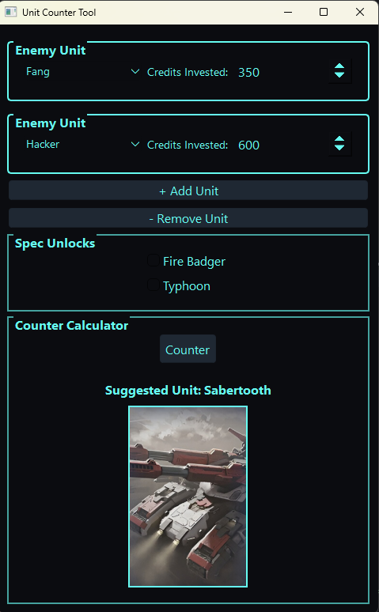

# Unit Counter Tool

A PyQt6-based desktop application for tracking and analyzing Mechabellum units. Users can dynamically add unit entries, select unit types from a dropdown, assign credits, and run a "Counter" function to get a randomly selected unit along with its corresponding image.

## Features

- 📦 Add unlimited unit input sections, each with:
  - Dropdown to choose a unit
  - Adjustable "credits invested" field with 100-credit steps
- 🔍 "Counter" button algorithmicly selects a unit from the list and displays:
  - The unit name
  - An image from the `./mechabellum units/` folder
- ✅ Checkbox toggles for Fire Badger and Typhoon spec units
- 🎨 Tech-themed styling and fully responsive layout
- 🧱 No scroll bars — window expands to fit content dynamically

## Setup Instructions

1. **Clone the repository** or download the `.py` file.

2. **Install dependencies**:
   ```bash
   pip install PyQt6
   ```

3. **Prepare your unit images**:
   - Place images in a folder named `mechabellum units` in the same directory as the script.
   - Image filenames must match unit names exactly (e.g., `Sabertooth.jpg`, `War Factory.jpg`).

4. **Run the script**:
   ```bash
   python unit_counter.py
   ```

## Folder Structure

```
project/
│
├── unit_counter.py
├── mechabellum units/
│   ├── Abyss.jpg
│   ├── Sabertooth.jpg
│   ├── War Factory.jpg
│   └── ... etc
```

## Example

  
_(Optional: Add a screenshot of the UI here)_

## License

MIT License

## Author

Dylan Gooley
